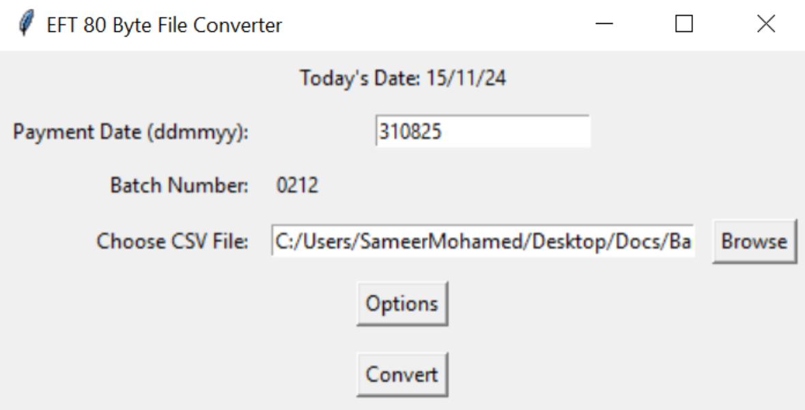
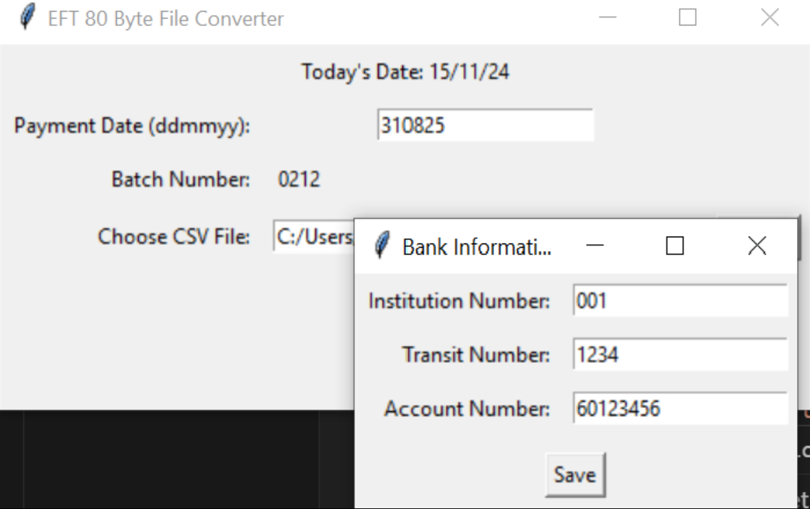
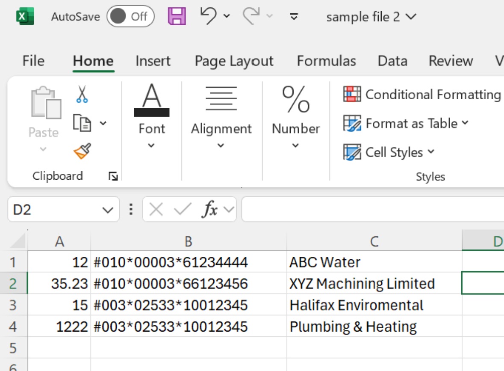
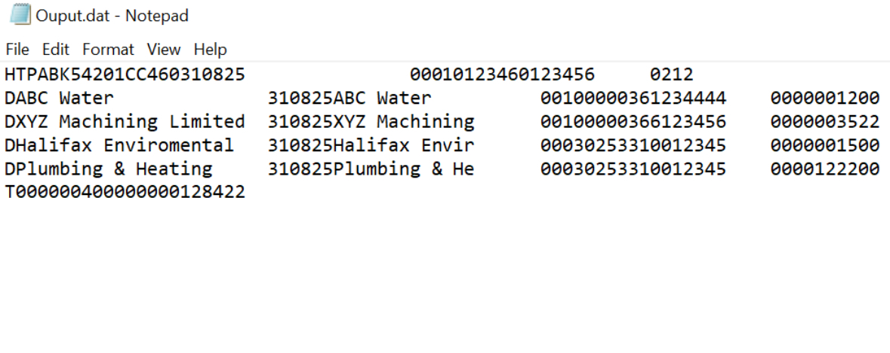

# Bank-Automation
Developed this for a samll organizaiton to help with payouts.

This is a Python program with GUI to automate vendor payouts for businesses handling large daily transactions. The tool generates .dat files used by major banks to automatically transfer funds from business accounts to vendor accounts, streamlining payment processing.

# Features

- Convert CSV files with payment data to a custom .dat format.
- Specify payment details such as payment date, batch number, and bank information.
- Supports easy file selection and conversion using a GUI.
- Auto-increments the batch number for each conversion.
- Saves the output .dat file in the same directory as the input .csv file.

# Requirements

- Python 3.x (if using the Python script)
- Tkinter (for the GUI)

# Installation

Option 1: Run with Python (Script) `python converter.py`

Option 2: Download and open `converter.exe`

# Images

Easy to use main sceen, displays system date and accepts valid inputs according to bank's specifications.

Options screen to input senders banking information for validation.

This is how a sample expense CSV file looks like.

Formatted .dat file accepted by most large banks, with information parsed from csv and formatted in a way automatically accepted by banks.